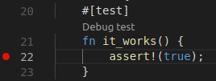

# Rust Test Lens

A code lens to debug test in rust source files.

## Requirements

Depends on the LLDB extension [vscode-lldb](https://marketplace.visualstudio.com/items?itemName=vadimcn.vscode-lldb).

## Extension Settings

This extension can be enabled/disabled using the following setting:

* `rust_test_lens.enable`: true/false to enable/disable this extension
